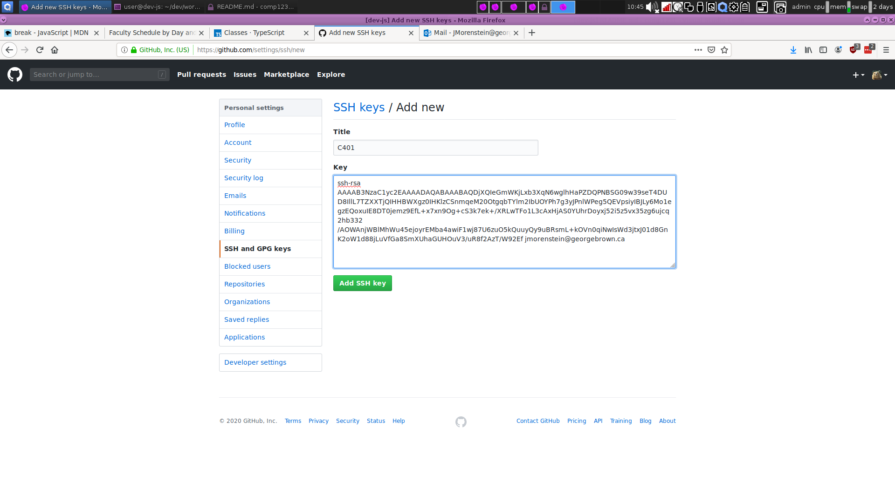

# comp1231

## Commands Used In Week 1

```bash
mkdir # creates a directory
# mkdir requires one argument containing the dir name
mkdir comp1231

cd # changes a directory
# cd will also require an argument to know where to go
# if no argument is passed `cd` will bring you to your home directory
cd comp1231

# establishing version control tracking with git
git init # initialiazes a directory as a git project
# WARNING: do not execute this command in parent directories of git projects or you will create submodules and headaches

# adding a file to be tracked by git
git add FILENAME # FILENAME is the name of the file you'd like to add
git commit -m 'a descriptive message specifying the work completed' # try to make the message as descriptive as possible so peers and your future self know what work was committed

git remote add origin git@github.com/YOUR_NAME/YOUR_REPO.git
# the above command creates an alias, in this case we called it origin. origin will point to your repository so when you push your code it has a remote address to send the work too.

git push -u origin master
# the above command will push the work you've committed to the origin you've set. It will also live on the master branch. More on branching later. For now, think of master as your single source of truth for working code. You want master to contain work that has been qualified and working.

ls -la # lists the content of the directory, including hidden files
```

## Generating SSH Keys

> SSH is a protocol known as Secure Shell. It's used to securely transfer files from a client to a server or a server to a client. There is no password required to use the protocol.

> SSH allows us to transfer our local work safely to GitHub or any remote server that has our public key.
```bash
# to generate an SSH key pair the following command is used
ssh-keygen -t rsa -b 4096 -C "your_email@example.com"
# the above command creates to files
# id_rsa (private key: treat it like a password)
# id_rsa.pub (public key, this is what we share with our peers or remote servers we would like to authenticate with)
```

By default, the SSH key pair will be generated in your home directory. If there are no default changes made to the questions asked after generating your SSH key pair, the keys should live in `~/.ssh`. If you decided to include a password, the password must be entered every time you make an SSH connection.

Once we've generated SSH keys, we want to make sure that we have access to our public key. For this to happen, you'll need to be in the directory where your public key lives (id_rsa.pub or whateveryounamedit.pub).

Below is an example of how I'd retrieve my public key:
```bash
cat ~/.ssh/id_rsa.pub

#the output of this should like something like the following: 

ssh-rsa AAAAB3NzaC1yc2EAAAADAQABAAABAQDjXQIeGmWKjLxb3XqN6wglhHaPZDQPNBSG09w39seT4DUD8IllL7TZXXTjQIHHBWXgz0IHKlzCSnmqeM20OtgqbTYlm2IbUOYPh7g3yJPnlWPeg5QEVpsiyIBJLy6Mo1egzEQoxuIE8DT0jemz9EfL+x7xn9Og+cS3k7ek+/XRLwTFo1L3cAxHjAS0YUhrDoyxj52i5z5vx35zg6ujcq2hb332/AOWAnjWBlMhWu45ejoyrEMba4awiF1wj87U6zuO5kQuuyQy9uBRsmL+kOVn0qiNwIsWd3jtxJ01d8GnK2oW1d88jLuVfGa8SmXUhaGUHOuV3/uR8f2AzT/W92Ef jmorenstein@georgebrown.ca

```

With the public key, we want to supply it to GitHub. Take a look at the screen shot below to see where it goes in GitHub.

[link to the settings page, just make sure you're signed in before clicking](https://github.com/settings/profile).



After you have your public key taken from ~/.ssh/id_rsa.pub (so long you didn't change default settings when generating), you should see something similar to above.