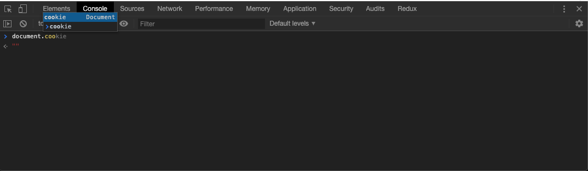

# Cookies :cookie:

Looking back at the previous week we've been introduced to a concept known as key/value storage. A key is defined a value, and the value is retrieved when the key is called.


## Object Review
```js
// create object
const cookieJar = {}

// add properties to the object
cookieJar.count = 18
cookieJar.flavour = 'chocolate chip'

console.log(cookieJar)
// output: {count: 18, flavour: "chocolate chip"}

// dot notation to retrieve a value
console.log(cookieJar.count)
// output: 18

// breacket notation to retrieve a value
console.log(cookieJar['flavour'])
// output: 'chocolate chip'
```

If we observe two lines above, specificially where the key is assigned a value, and then pay attention to the retrieval of the value in the console logs, we can see an example of key/value storage used.

One more example

```js
const cookieDough = {}
cookieDough.flavour = 'Birthday Cake'

console.log(cookieDough.flavor)
// output: 'Birthday Cake'
```

Just as we have objects to store and retreive data in JavaScript, we also have the notorious `cookie`. To be specific - a cookie is a small piece of data that a server sends to the users browser in order to transfer information. The data is sent in the form of key/value storage.

Cookies aren't just for HTTP use, we can also leverage them in our own applications. JavaScript has an odd API to offer when interacting with cookies but we'll get through it.

We've been introduced to the `document` object, used some methods found within it such as `.querySelector()` and `.getElementById()` to parse HTML elements with JS. The `document` object is filled with properties which represent the page that is loaded in the browser. Just as an example, `document.location` will always return an object which provides details on the documents location. Try running it in your console.

## Cookie Introduction
Just like we can retrieve all the information on our documents location, we can do the same with `cookie`. To find out what cookies may have been set by the server or perhaps locally executed with JS code, let's see cookies are on our document. What document are we on though?

1. Open a browser
2. Navigate to [Reddit](https://reddit.com)
3. Open Your developer tools
4. Ensure that you are in the dev tools console area



```js
const allTheCookies = document.cookie
console.log(allTheCookies)
"edgebucket=9a2uKIeIyenX2ZISiY;  csv=1; "
```

As you can see, I've truncrated a great portion of what's console logged. What should be apparent here though is that we have a key value storage pattern. It's not exactly the same as the previous example when we used object, but the point here is the left hand side is a variable for a value. The `=` is used to delimit the variable from the value. The semicolon terminates the key/value combination and makes it official.

How many cookies are stored in the above code snippet? If you said two, you are correct. The two cookies found in the `allTheCookies` variable were `edgebucket` and `csv`. Both these keys are seperated from their value with an `=`. For example - the value for the `csv` key is `1`. Remember all of this is coming from the cookie object courtesy of `document`. We were able to observe this by executing document.cookie in the JS console. Try your favorite page, see what info they have hidden in their cookie object.

## Creating Cookies
